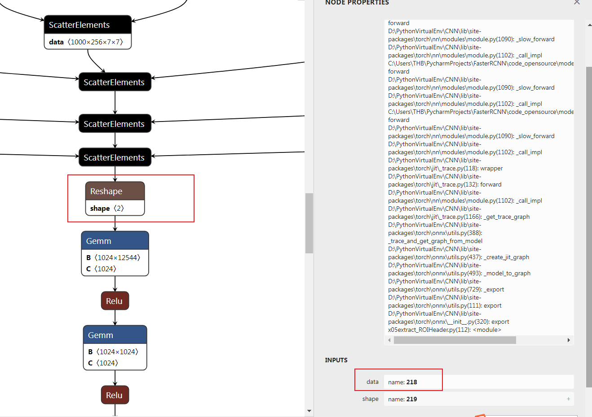
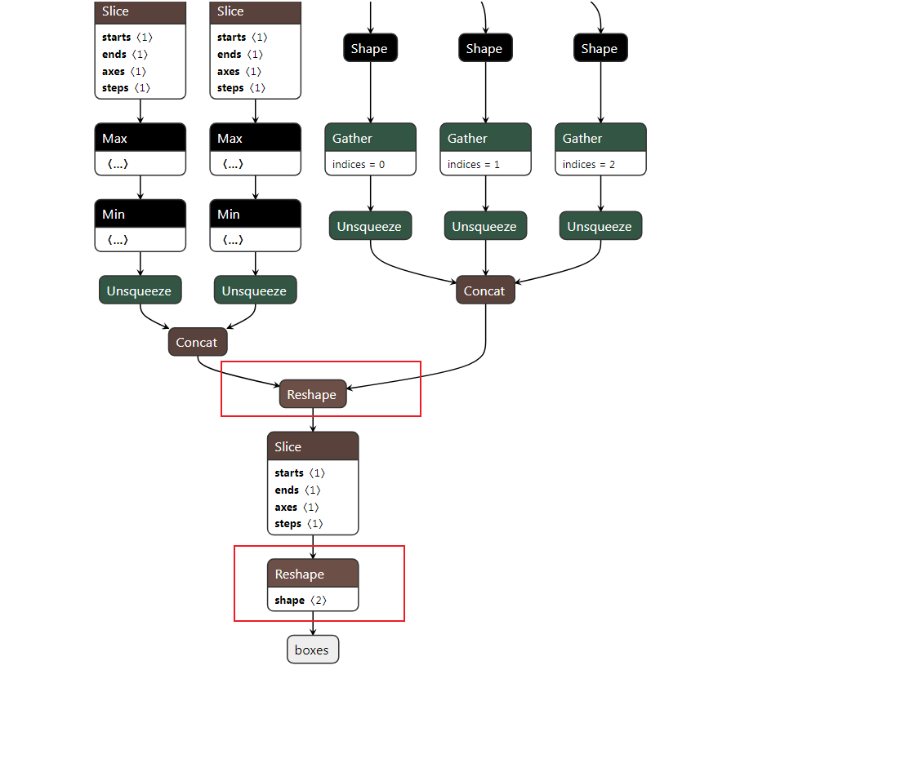

# TensorRT部署FasterRCNN

> 我们推出了当前版本的升级，支持训练、动态batch、fp16且精度与onnx对齐，欢迎star  
> https://github.com/thb1314/maskrcnn-tensorrt

> **本项目为torchvision中的fasterrcnn_resnet50_fpn（即FasterCNNN+ROIAlign+FPN）在TensorRT上的部署提供了解决方案。**

FasterRCNN作为经典的two-staged detector，至今为止其精度配合FPN+ROIAlign依然SOTA。

然而FasterRCNN在TensorRT的部署却没有one-stage的检测器那么容易。因为TensorRT输入输出要求shape是确定值，就算新的版本支持动态batch_size，但是在一开始也要确定最大输入的batch_size，中间的算子是不允许运行时更改维度的。

这成为FasterRCNN+FPN+ROIAlign在TensorRT部署的难点，**因为rpn的输出需要经过nms+roialign，尽管nms和roialign可以通过plugin的方式来实现，但是nms的输出是不固定的。**

**此外，在计算roialign计算时，应该采用fpn哪个输出层的feature作为roialign的输入，是根据rpn输出的bbox来计算的，onnx对于这里的计算步骤用计算图的表示引入了大量的判断算子，这在TensorRT的onnx解析器中是不支持的。**

本项目采用`torchvision.models.detection.fasterrcnn_resnet50_fpn`为待部署模型，着手解决部署中产生的一些问题。

主要思路：**将rpn部分和检测头分开，分成两个模型。rpn部分采用onnx解析，nms+roialigin部分使用原生cuda来做。处理后的feature送入header部分，然后再一次经过cuda实现的nms得到最终结果。**


*本项目的调试技巧主要是对齐输入输出，中间调试过程将不演示。*

## 预备环境

安装torch、torchvision

```
torch==1.10.0
torchvision==0.11.1
```

安装onnx-simplifier

```bash
pip install onnx-simplifier -U
```

安装onnx_graphsurgeon

```bash
# https://github.com/NVIDIA/TensorRT/tree/master/tools/onnx-graphsurgeon
python3 -m pip install onnx_graphsurgeon --index-url https://pypi.ngc.nvidia.com
```

安装TensorRT8.0版本

详细步骤见tensorrt_code文件夹

## onnx生成步骤

> 为了与torchvision库中的fasterrcnn隔离，方便修改，我将torchvision中的fasterrcnn移植到model文件下下面，并对一些shape操作和onnx导出做了处理，主要是新建了两个模型，一个是rpn部分，一个是header部分
>
> 原则1：reshape操作第一个值为-1，即设置为batch size大小不固定
>
> 原则2：针对一些tensorrt不友好的算子比如：原地赋值、nonzero算子，equal算子等尽可能以另外方式等价替代或者舍弃


> 文件的执行需要 one by one，不要跳。此外，请根据情况请改源码中的部分onnx表示


相关onnx生成文件在test路径下，x01-x08即为整体思路演示

1. `x01export_FasterRCNN_onnx.py`：导出FasterRCNN整体模型onnx

2. `x02test_FasterRCNN_onnx.py`：测试导出FasterRCNN onnx文件

3. `x03extract_RPN.py`：导出rpn部分的onnx，不含nms

   设定onnx输入为

   - `input`：输入图像，shape:1x3x608x800

   设定onnx输出为

   - `rpn_boxes`:输出的rpn_boxes，其值为图像真实大小的矩形框+objectness+level,shape:**1,4390,6**

     1表示batch size，4390表示bounding box个数，6表示输出属性，分别为objectness,left,top,right,bottom,level（level表示当前anchor在fpn的第几层输出的，方便后面的nms处理）

   - `feature_0`:fpn第一层输出的feature，作为roi_align的输入来用

   - `feature_1`:fpn第二层输出的feature，作为roi_align的输入来用

   - `feature_2`:fpn第三层输出的feature，作为roi_align的输入来用

   - `feature_3`:fpn第四层输出的feature，作为roi_align的输入来用

   - `feature_pool`:训练时候用的，推理时候应当被舍弃。接下来的文件会处理掉该项

4. `x04testRPNonnx.py`：测试导出rpn onnx是否可以正常运行,

5. `x05extract_ROIHeader.py`：导出检测器header部分的onnx，主要包括

   - 对`rpn_boxes`中`fpn_level`的计算，`fpn_level`表示当前的坐标应该对哪个feature做roi_align
   - roi_align
   - 对roi_align的输出接全连接层做进一步处理

   后面我们仅保留全连接层的处理部分，前面两部分使用原生cuda来实现

6. `x06reduceRpnOnnx.py`：去掉rpn onnx的最后一个输出，即`feature_pool`

7. `x07reduce_header_onnx.py`：精简header onnx，仅保留全连接层部分。具体细节：

   1. 将网络的输入更改为`roialigned_feature`和`proposals`，去掉roi align和fpn_level的计算部分。

      `tensor = tensors["218"]` Line11 这段代码即对该reshape操作输入的替换。

      **这里需要根据自己的生成的onnx改变名字**

      

   2. 对输出的box和score节点的前面的reshape操作进行处理

      

      

      对应一下几行代码

      **这里需要根据自己的生成的onnx修改，切记**
      
      ```python
      shape_score = gs.Constant(name="shape_score", values=np.array((-1, 90), dtype=np.int64))
          shape_boxes = gs.Constant(name="shape_boxes", values=np.array((-1, 90, 4), dtype=np.int64))
          shape_boxes_last_node = gs.Constant(name="shape_boxes_last_node", values=np.array((-1, 91, 4), dtype=np.int64))
      
      # 这里的Reshape_320和Reshape_322是box和score的上一个reshape节点
      # 这里填写上面的框选的部分分
      for node in graph.nodes:
          if node.name == "Reshape_320":
              node.inputs[-1] = shape_boxes
          elif node.name == "Reshape_322":
              node.inputs[-1] = shape_score
          # the last second reshape node relative to box output
          elif node.name == "Reshape_308":
              node.inputs[-1] = shape_boxes_last_node
      ```

8. `x08test_header_onnx.py`对新的header部分的onnx的动态batch size进行测试，因为要求这里的batch size的输入是可变的，所以要验证一下该功能。


## TensorRT部分

> 本部分基于repo 
>
> https://github.com/shouxieai/tensorRT_cpp
>
> 安装部分请看该项目的readme部分，在本项目文件下`tensorrt_code`下
>
> 如果可以给该项目点个star的话，麻烦顺手给俺也点一个吧，谢谢。

运行本项目可以在`build`文件夹下使用

```bash
make fasterrcnn -j8
```

也可以编译好之后在`workspace`文件夹下面是用

```
./pro fasterrcnn
```

使用准备工作：

1. 将`new_header.onnx`和`rpn_backbone_resnet50.onnx`放入`workspace`文件夹下面


### 分析-重要star


tensorRT部分需要完成哪些事？

1. 对输入进行预处理
2. 对`rpn_backbone_resnet50.onnx`的输出进行nms处理，以及求取roi_align后的feature
3. 创造`new_header.onnx`的输入，将nms后的bbox和roi_align计算后的feature送入header部分
4. 对`new_header`的输出进行nms处理


roi_align如何实现？

1. 移植onnxruntime的cuda实现代码（验证导出onnx的时候，已经证明onnxruntime实现的正确性）
2. 看原版论文和torchvision的实现计算fpn_level
3. 将以上两点结合，对不同fpn_level动态选择不同feature进行roi_align计算


以上需求的实现可以在`tensorrt_code/application/src/application/app_fasterrcnn`中可以找到

## 其他

### FasterRCNN的训练

demo: https://www.cnblogs.com/wildgoose/p/12905004.html

其他git code还请自行查找

导出onnx的时候，需要加载加载自己训练的权重。


### QA

如果有问题请在issue区交流。

如果有更好的实现方式，欢迎pr。
